  <h3><code>shahrukh@github ~ $ ./contributions.sh</code></h3>
  
    
  <h3><code>shahrukh@github ~ $ whoami</code></h3>
  <table><tr>
    <td valign="top"></td>
    <td valign="top"></td>
  </tr></table>
   
  <h3><code>shahrukh@github ~ $ ls projects/</code></h3>
  
<a href="https://github.com/shahrukh-210906/Neurolog-AI">Neurolog-AI</a> · <a href="https://github.com/shahrukh-210906/WONDERLUST">WONDERLUST</a> · <a href="https://github.com/shahrukh-210906/LiftEat">LiftEat</a> · <a href="https://github.com/shahrukh-210906/DSA">DSA</a> · <a href="https://github.com/shahrukh-210906/Portfolio">Portfolio</a>

  
Built with Python + animated SVG. Contribution data refreshes daily through GitHub Actions.

About this profile

Artwork lives in this repository and plays once on load, with reduced-motion support. Public contribution data comes from GitHub's calendar; no personal access token or external stats service is needed.

Inspired by [Avi Vashishta's animated README guide](https://www.avivashishta.com/blog/build-animated-github-profile-readme). The implementation here is original.

