  <h1>Hi, I'm Mohd Shahrukh</h1>
  <h3>Building useful web experiences. Exploring AI. Creating with code and film.</h3>
  
Student at Woxsen University · Web developer · Tech enthusiast

  
<a href="https://www.linkedin.com/in/mohd-shahrukh-913b2b36b">LinkedIn</a> · <a href="https://github.com/shahrukh-210906/Portfolio">Portfolio source</a>

   
  <table><tr>
    <td width="300" valign="middle"></td>
    <td width="550" valign="middle">
      <h3>Code meets creativity</h3>
      
I build responsive web applications and enjoy turning ideas into interfaces people can use. My projects span fitness tracking, personal portfolios, and algorithm practice.

      
I'm interested in AI-powered applications and strengthening my problem-solving skills. Away from code, I enjoy capturing visuals and telling stories through film.

      
<b>Working with</b> React · TypeScript · JavaScript · Tailwind CSS Node.js · Express · MongoDB · Firebase · Vite

    </td>
  </tr></table>

 

### Featured projects

| Project | What it does | Technologies & standout feature |
| --- | --- | --- |
| **[LiftEat](https://github.com/shahrukh-210906/LiftEat)** | Fitness tracker with workouts, food logs, and AI coaching. | React, TypeScript, Express, MongoDB, Firebase · coaching informed by logged activity. |
| **[Portfolio](https://github.com/shahrukh-210906/Portfolio)** | Personal developer portfolio with a project showcase. | React, Tailwind CSS, Vite · responsive design, animations, and dark mode. |
| **[DSA](https://github.com/shahrukh-210906/DSA)** | A growing collection of algorithm problem solutions. | Arrays, strings, matrices, and problem solving · practice through concrete coding challenges. |

### Current interests

- **Full-stack development:** connecting polished interfaces with useful APIs and persistent data.
- **AI in applications:** exploring practical coaching and analysis features through LiftEat.
- **Data structures & algorithms:** building stronger problem-solving fundamentals.

 

  <h3><code>shahrukh@github ~ $ ./contributions.sh</code></h3>
  
  
Generated from real public GitHub activity. Refreshed daily with GitHub Actions.

Behind the profile

The character portrait was created from my photo using AI image generation. The animated contribution calendar is generated with Python and committed to this repository; it supports reduced motion.

Profile structure inspired by [GitHub Profile Optimizer](https://github.com/shraaaa17/github-profile-optimizer). Contribution artwork inspired by [Avi Vashishta's guide](https://www.avivashishta.com/blog/build-animated-github-profile-readme).

